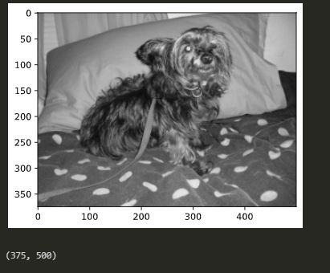
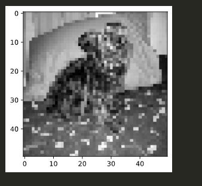
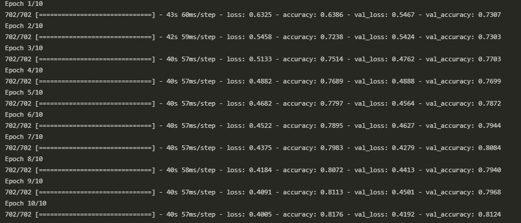

# Cat Dog Detection

CNN model that detects pictures of cats and dogs

## Requirements

-   Python 3.9.1
-   Tensorflow
-   Keras
-   Folder of Cats and Dogs

## Folder Structure

```
PetImages/
--/Cat (file name  #.jpg)
--/Dog (file name  #.jpg)
```

## Example dataset

**Not Normalized**



**Normalized**



## Training process (Read comments on jupyter notebook detailed explanation)


